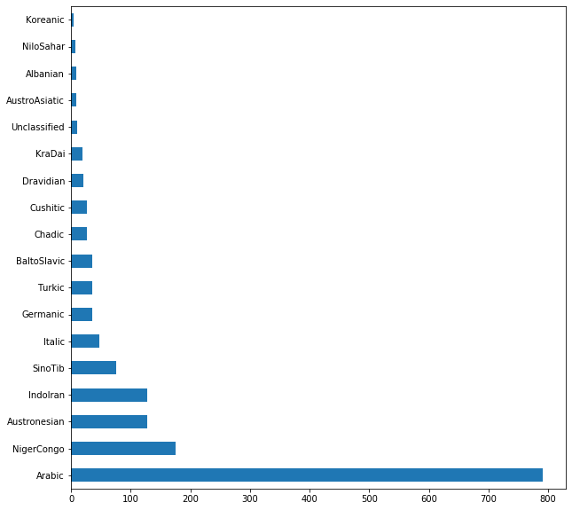
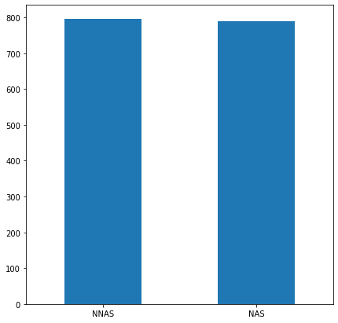

# Final Report: Arabic Learner Corpus Considerations 
Anthony Verardi | a.verardi@pitt.edu | 3/24/2020 | University of Pittsburgh

This document serves as the final analysis of my project ["Arabic Learner Corpus Considerations"](https://github.com/Data-Science-for-Linguists-2020/Arabic-Learner-Corpus-Considerations) as
well as a chronicle of the process that it took to get here. I hope that you find this project both
thoughtful and interesting!

***

## Contents
1. [Introduction](#INT)
	1. [Motivation](#MOT)
	1. [About the Arabic Learner Corpus](#ALC)
		1. [Licensing](#LIC)
	1. [Research Question](#REQ)
1. [Data Organization](#DOG)
1. [Data Analysis](#DAL)
1. [Project History](#PRH)
1. [Conclusion](#CON)
1. [Works Referenced](#REF)

***

### Introduction 

#### Motivation 
The motivation for this project stems mainly from my own experiences as both an L2 learner and later instructor 
of Arabic. As both a learner and instructor, I was fascinated by the fact that Arabic is diglossic, with a dialectal,
vernacular variety being most people's L1 and Modern Standard Arabic (MSA) being a prestige variant that is mainly used
for written and spoken formal, professional communication. To this end, the current project was informed by a desire
to look at the differences between L2 text production (written or spoken) by both native speakers acquiring the
prestige variant of their language and non-native speakers learning the prestige variant assumedly from the ground up
(assuming that non-native speakers have no prior Arabic background besides years of study).

Both MSA and its various dialectal varieties (such as Levantine Arabic, Egyptian Arabic, Gulf (Khaliji Arabic), and so
on) remain understudied in both Second Language Acquisition (SLA) and Computational Linguistics (Alhawary, 2018). 
Furthermore, although a number of freely-available Arabic-language corpora do exist, their quality is often dubious 
or confined to a highly-specific domain (Zaghouani, 2014). As such, when I came across the
[Arabic Learner Corpus (ALC)](https://www.arabiclearnercorpus.com/), I knew that I wanted to work with it for a number of reasons:

1. most importantly, it was freely available and contained files in a format that I knew I could use (XML)
1. freely-available Arabic-language corpora are pretty sparse, let alone learner corpora with robust textual data and metadata
1. it would give me the chance to work with text data in a non-Latin script
1. I could see potential applications for the corpus and wanted to test it out

Perhaps most importantly, I was motivated by a desire to test out this corpus in a way that was familiar enough to have some
grounds to compare, but also novel enough to challenge me: building a classifier and seeing if it could accurately label the L1
of the writer, and later on (with a second model) whether they were an L1 Arabic speaker or not. The idea came to me while working
with the ETS corpus for a homework assignment, which had a number of differences inherent to it: the languages represented were 
much more evenly distributed than in this corpus, it contained fewer languages overall, and all participants were writing in an L2.
This corpus, by contrast, contains text samples from both native speaker learners and non-native speaker learners alike.

#### About the Arabic Learner Corpus 
As mentioned above, the ALC contains writing and (transcribed) speech samples from both native speakers of Arabic learning MSA
and non-native speakers learning the same variant. All of these data were collected in 2012 and 2013 in Saudi Arabia. 
The downloadable corpus files include 1,585 XML documents with both metadata about each participant, about the text, and
the text itself in Arabic (metadata is available in both English and Arabic). While there were also part-of-speech files
pre-tagged and available, I chose to work with the raw data instead, since it would allow me to access demographic metadata
about each participant. For future work, I would be interested in working with the POS-tagged data, now that I'm more familiar 
with this corpus on the whole.

There were two prompts present in the corpus that learners were tasked with responding to: the first was to **narrate** the best
vacation they had ever taken, while the second was to **discuss** their current (and possibly also future) plans for academic study.
Although there are 1,585 observations of data as noted above, there were only a total of 942 participants in this study; this is not
intended to disparage the number of participants, but rather to note that not all participants completed all tasks. The maximum
number of texts that any participant created was five.

##### Licensing 
Thankfully, the ALC is available under a [Creative Commons License Attribution-NonCommercial 4.0 International (CC BY-NC 4.0)](https://github.com/Data-Science-for-Linguists-2020/Arabic-Learner-Corpus-Considerations/blob/master/LICENSE.md)
which allows for reproduction, modification, and sharing, provided that the resulting work 1) contains attribution to the original
authors and 2) is not used for commercial purposes. This allowed me to make as much of my project public as I wanted, and in turn,
I used the same license to cover my project as well in its entirety. In choosing a license, it was important to me that none of the 
data used be available for commercial purposes, since this felt like a violation of research ethics; this would have been the case
even if the original license had allowed modification and distribution for commercial purposes.

#### Research Question 
For my research question, I initially started out with the lofty and, in hindsight, unfair ambition of testing the "validity" of this
corpus. As the semester continued, I changed my outlook after coming to recognize that of course a dataset would fail if an appropriate
question was not being asked. To this end, my research question could best be formulated as "can the ALC be used to train a classifier
model to identify the L1 and nativeness of text producers? What are the challenges that must be overcome throughout this process in
order to build a functional model on potentially sparse data?" and the analysis that you are reading has been formulated with this goal
in mind. That being said, I am also interested in potential insights into the most salient features of native Arabic speaker vs.
non-native Arabic speaker that a classifier would return, and what they may tell us from a Second Language Acquisition lens.

***

### Data Organization 
[Data Organization](https://nbviewer.jupyter.org/github/Data-Science-for-Linguists-2020/Arabic-Learner-Corpus-Considerations/blob/master/Notebooks/ALC_Data_Organization.ipynb)
for this project proved to be a back-and-forth process, one that I was engaged in up until the very final submission. The first challenge came
from simply importing the data itself into a `pandas DataFrame` object: [using BeautifulSoup to load in the XML data and extract the tagged
information that I wanted](https://nbviewer.jupyter.org/github/Data-Science-for-Linguists-2020/Arabic-Learner-Corpus-Considerations/blob/master/Notebooks/ALC_Data_Organization.ipynb#BS4).
It took a lot of thinking from both my instructor, Dr. Jevon Heath, and [Stack Overflow](https://stackoverflow.com/questions/45821807/open-and-parse-multiple-xml-files-from-a-folder) to find a solution. 

The advantage of using XML files here is that it allowed me to pull from data that was already highly structured and import it under my own
labels (I made a point to rename "mothertongue" from the original XML to "L1" in my `DataFrame`, for example). After successfully managing
to import the data and set it into a `DataFrame` object, I went through a first wave of curation that involved [filling in "NaN" values in
the text titles](https://nbviewer.jupyter.org/github/Data-Science-for-Linguists-2020/Arabic-Learner-Corpus-Considerations/blob/master/Notebooks/ALC_Data_Organization.ipynb#NaN), 
[tokenizing all of the text data and adding word counts](https://nbviewer.jupyter.org/github/Data-Science-for-Linguists-2020/Arabic-Learner-Corpus-Considerations/blob/master/Notebooks/ALC_Data_Organization.ipynb#TOK), 
and [adding my own calculation for TTR](https://nbviewer.jupyter.org/github/Data-Science-for-Linguists-2020/Arabic-Learner-Corpus-Considerations/blob/master/Notebooks/ALC_Data_Organization.ipynb#TTR).

In the end, I actually wound up using less of the metadata than I had anticipated (as well as my TTR calculation and the tokenized texts/titles), but the fact that I saved the `DataFrame`
and pickled it for my own use in the future will almost certainly prove useful if I want to revisit this project or this corpus. At this point I tried to jump into my analysis,
but it quickly became clear that there were too many languages represented in the data (66 total different L1s) for me to do what I wanted to do, so I had to return
to organization. I decided to [collapse the L1 data](https://nbviewer.jupyter.org/github/Data-Science-for-Linguists-2020/Arabic-Learner-Corpus-Considerations/blob/master/Notebooks/ALC_Data_Organization.ipynb#L1FAM)
from micro-level individual languages to macro-level language families, using [Ethnologue](https://www.ethnologue.com) as a guide. This left me with a far more manageable 
18 categories instead of the initial 66 L1s, which I have visualized as such:

The final return to my organization notebook came at the close of this project when I decided to further collapse the languages and rely instead on 
"Nativeness" (as opposed to non-L1 Arabic speaker status), which was originally a tag that I had not imported. This equated to simply adding one new
thing to my `DataFrame` using `BeautifulSoup` again, and gave me this result that shows the proportion of native speaker texts to non-native speaker texts
is very even:

With all relevant data finally collected and curated, I turned to beginning the analysis portion of this project.

***

### Data Analysis 

***

### Project History 
Aside from the [above difficulties in initially getting `BeautifulSoup` to work](#DOG), this project was seldom marred by gross setbacks or stumbling blocks
(COVID-19 notwithstanding). 

***

### Conclusion 

***

### Works Referenced 

> Alfaifi, A., Atwell, E. and Hedaya, I. (2014). Arabic Learner Corpus (ALC) v2: A New Written and 	Spoken Corpus of Arabic Learners. In the proceedings of the Learner Corpus Studies in 	Asia and the World (LCSAW) 2014, 31 May - 01 Jun 2014. Kobe, Japan. <>.

> Alhawary, M. T. (2009). Arabic Second Language Acquisition of Morphosyntax. New Haven, 	United States: Yale University Press.

> Alhawary, M. T. (Ed.) (2018). Routledge Handbook of Arabic Second Language Acquisition (1 	ed.). London: Routledge.

> Zaghouani, Wajdi. (2014) Critical Survey of the Freely Available Arabic Corpora. Published in 	the Proceedings of the International Conference on Language Resources and Evaluation 	(LREC'2014), OSACT Workshop. Reykjavik, Iceland, 	26-31 May 2014
