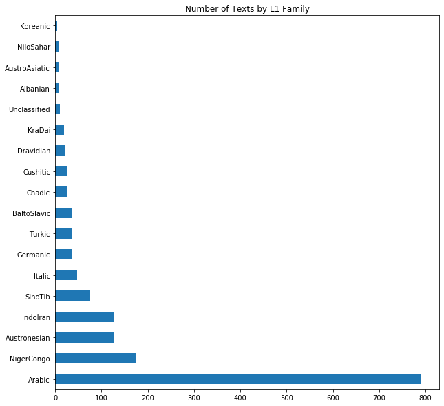
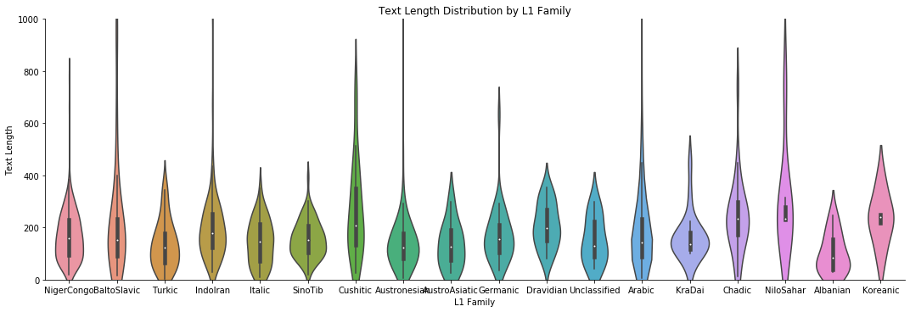
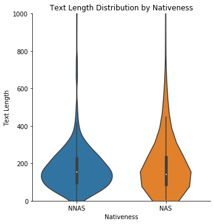
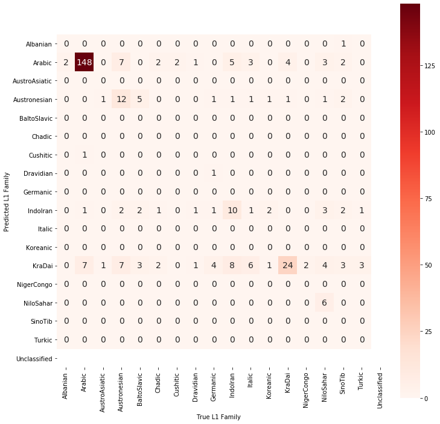
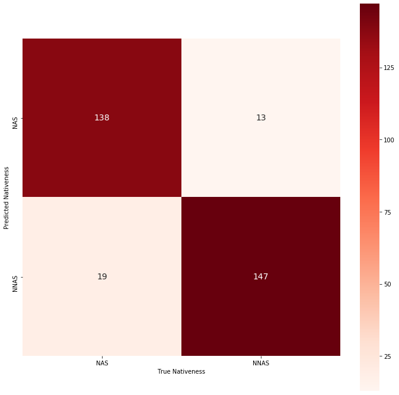

# Final Report: Arabic Learner Corpus Considerations 
Anthony Verardi | a.verardi@pitt.edu | 3/24/2020 | University of Pittsburgh

This document serves as the final analysis of my project ["Arabic Learner Corpus Considerations"](https://github.com/Data-Science-for-Linguists-2020/Arabic-Learner-Corpus-Considerations) as
well as a chronicle of the process that it took to get here. I hope that you find this project both
thoughtful and interesting!

***

## Contents
1. [Introduction](#INT)
	1. [Motivation](#MOT)
	1. [About the Arabic Learner Corpus](#ALC)
		1. [Licensing](#LIC)
	1. [Research Question](#REQ)
1. [Data Organization](#DOG)
1. [Data Analysis](#DAL)
1. [Project History](#PRH)
1. [Conclusion](#CON)
1. [Works Referenced](#REF)

***

### Introduction 

#### Motivation 
The motivation for this project stems mainly from my own experiences as both an L2 learner and later instructor 
of Arabic. As both a learner and instructor, I was fascinated by the fact that Arabic is diglossic, with a dialectal,
vernacular variety being most people's L1 and Modern Standard Arabic (MSA) being a prestige variant that is mainly used
for written and spoken formal, professional communication. To this end, the current project was informed by a desire
to look at the differences between L2 text production (written or spoken) by both native speakers acquiring the
prestige variant of their language and non-native speakers learning the prestige variant assumedly from the ground up
(assuming that non-native speakers have no prior Arabic background besides years of study).

Both MSA and its various dialectal varieties (such as Levantine Arabic, Egyptian Arabic, Gulf (Khaliji Arabic), and so
on) remain understudied in both Second Language Acquisition (SLA) and Computational Linguistics (Alhawary, 2018). 
Furthermore, although a number of freely-available Arabic-language corpora do exist, their quality is often dubious 
or confined to a highly-specific domain (Zaghouani, 2014). As such, when I came across the
[Arabic Learner Corpus (ALC)](https://www.arabiclearnercorpus.com/), I knew that I wanted to work with it for a number of reasons:

1. most importantly, it was freely available and contained files in a format that I knew I could use (XML)
1. freely-available Arabic-language corpora are pretty sparse, let alone learner corpora with robust textual data and metadata
1. it would give me the chance to work with text data in a non-Latin script
1. I could see potential applications for the corpus and wanted to test it out

Perhaps most importantly, I was motivated by a desire to test out this corpus in a way that was familiar enough to have some
grounds to compare, but also novel enough to challenge me: building a classifier and seeing if it could accurately label the L1
of the writer, and later on (with a second model) whether they were an L1 Arabic speaker or not. The idea came to me while working
with the ETS corpus for a homework assignment, which had a number of differences inherent to it: the languages represented were 
much more evenly distributed than in this corpus, it contained fewer languages overall, and all participants were writing in an L2.
This corpus, by contrast, contains text samples from both native speaker learners and non-native speaker learners alike.

#### About the Arabic Learner Corpus 
As mentioned above, the ALC contains writing and (transcribed) speech samples from both native speakers of Arabic learning MSA
and non-native speakers learning the same variant. All of these data were collected in 2012 and 2013 in Saudi Arabia. 
The downloadable corpus files include 1,585 XML documents with both metadata about each participant, about the text, and
the text itself in Arabic (metadata is available in both English and Arabic). While there were also part-of-speech files
pre-tagged and available, I chose to work with the raw data instead, since it would allow me to access demographic metadata
about each participant. For future work, I would be interested in working with the POS-tagged data, now that I'm more familiar 
with this corpus on the whole.

There were two prompts present in the corpus that learners were tasked with responding to: the first was to **narrate** the best
vacation they had ever taken, while the second was to **discuss** their current (and possibly also future) plans for academic study.
Although there are 1,585 observations of data as noted above, there were only a total of 942 participants in this study; this is not
intended to disparage the number of participants, but rather to note that not all participants completed all tasks. The maximum
number of texts that any participant created was five.

##### Licensing 
Thankfully, the ALC is available under a [Creative Commons License Attribution-NonCommercial 4.0 International (CC BY-NC 4.0)](https://github.com/Data-Science-for-Linguists-2020/Arabic-Learner-Corpus-Considerations/blob/master/LICENSE.md)
which allows for reproduction, modification, and sharing, provided that the resulting work 1) contains attribution to the original
authors and 2) is not used for commercial purposes. This allowed me to make as much of my project public as I wanted, and in turn,
I used the same license to cover my project as well in its entirety. In choosing a license, it was important to me that none of the 
data used be available for commercial purposes, since this felt like a violation of research ethics; this would have been the case
even if the original license had allowed modification and distribution for commercial purposes.

#### Research Question 
For my research question, I initially started out with the lofty and, in hindsight, unfair ambition of testing the "validity" of this
corpus. As the semester continued, I changed my outlook after coming to recognize that of course a dataset would fail if an appropriate
question was not being asked. To this end, my research question could best be formulated as "can the ALC be used to train a classifier
model to identify the L1 and nativeness of text producers? What are the challenges that must be overcome throughout this process in
order to build a functional model on potentially sparse data?" and the analysis that you are reading has been formulated with this goal
in mind. That being said, I am also interested in potential insights into the most salient features of native Arabic speaker vs.
non-native Arabic speaker that a classifier would return, and what they may tell us from a Second Language Acquisition lens.

[Back to Top](#TOP)

***

### Data Organization 
[Data Organization](https://nbviewer.jupyter.org/github/Data-Science-for-Linguists-2020/Arabic-Learner-Corpus-Considerations/blob/master/Notebooks/ALC_Data_Organization.ipynb)
for this project proved to be a back-and-forth process, one that I was engaged in up until the very final submission. The first challenge came
from simply importing the data itself into a `pandas DataFrame` object: [using BeautifulSoup to load in the XML data and extract the tagged
information that I wanted](https://nbviewer.jupyter.org/github/Data-Science-for-Linguists-2020/Arabic-Learner-Corpus-Considerations/blob/master/Notebooks/ALC_Data_Organization.ipynb#BS4).
It took a lot of thinking from both my instructor, Dr. Jevon Heath, and [Stack Overflow](https://stackoverflow.com/questions/45821807/open-and-parse-multiple-xml-files-from-a-folder) to find a solution. 

The advantage of using XML files here is that it allowed me to pull from data that was already highly structured and import it under my own
labels (I made a point to rename "mothertongue" from the original XML to "L1" in my `DataFrame`, for example). After successfully managing
to import the data and set it into a `DataFrame` object, I went through a first wave of curation that involved [filling in "NaN" values in
the text titles](https://nbviewer.jupyter.org/github/Data-Science-for-Linguists-2020/Arabic-Learner-Corpus-Considerations/blob/master/Notebooks/ALC_Data_Organization.ipynb#NaN), 
[tokenizing all of the text data and adding word counts](https://nbviewer.jupyter.org/github/Data-Science-for-Linguists-2020/Arabic-Learner-Corpus-Considerations/blob/master/Notebooks/ALC_Data_Organization.ipynb#TOK), 
and [adding my own calculation for TTR](https://nbviewer.jupyter.org/github/Data-Science-for-Linguists-2020/Arabic-Learner-Corpus-Considerations/blob/master/Notebooks/ALC_Data_Organization.ipynb#TTR).

In the end, I actually wound up using less of the metadata than I had anticipated (as well as my TTR calculation and the tokenized texts/titles), but the fact that I saved the `DataFrame`
and pickled it for my own use in the future will almost certainly prove useful if I want to revisit this project or this corpus. At this point I tried to jump into my analysis,
but it quickly became clear that there were too many languages represented in the data (66 total different L1s) for me to do what I wanted to do, so I had to return
to organization. I decided to [collapse the L1 data](https://nbviewer.jupyter.org/github/Data-Science-for-Linguists-2020/Arabic-Learner-Corpus-Considerations/blob/master/Notebooks/ALC_Data_Organization.ipynb#L1FAM)
from micro-level individual languages to macro-level language families, using [Ethnologue](https://www.ethnologue.com) as a guide. This left me with a far more manageable 
18 categories instead of the initial 66 L1s, which I have visualized as such:

Since the Indo-European family is so large and typologically diverse, I decided to go one level down and break it into Indo-Iranian, Germanic, Balto-Slavic, and Italic.

The final return to my organization notebook came at the close of this project when I decided to further collapse the languages and rely instead on 
"Nativeness" (as opposed to non-L1 Arabic speaker status), which was originally a tag that I had not imported. This equated to simply adding one new
thing to my `DataFrame` using `BeautifulSoup` again, and gave me this result that shows the proportion of native speaker texts to non-native speaker texts
is very even:

With all relevant data finally collected and curated, I began to work on the analysis portion of this project as detailed below.

[Back to Top](#TOP)

***

### Data Analysis 

When turning to the analysis, I had initially wanted to lean more into [measures of dispersion and central tendency with the subgroups](https://nbviewer.jupyter.org/github/Data-Science-for-Linguists-2020/Arabic-Learner-Corpus-Considerations/blob/master/Notebooks/ALC_Data_Analysis.ipynb#subgroups)
that emerged in this dataset, like the different language families. In the end, I decided against examining more than just text length, since it was the most
directly relevant variable for building a classifier. While my original goal had been to determine whether these data could be used for inferential statistics,
I focused instead on what considerations could be made for training a classifier, and concluded that the more even the text distributions (both in terms of
the raw number of texts per language/nativeness group and the length of the texts within this groups), the better my classifier was likely to perform.

Comparing violin plots of the text length values by L1 family (top) and the text length values by nativeness (bottom), we see that the uniformity of these
data increases as the number of categories decreases. In other words, collapsing the L1 data into "Arabic" vs. "non-Arabic" homogenizes the samples.

While these visualizations don't necessarily reflect anything about the classifier, I think it's important to consider their implications for the corpus
as a whole. It turns out that despite the imbalance in total number of texts between the Arabic L1 group and the other L1 groups, the texts that do exist
in the other groups are reasonably well-distributed with regard to their text length. This holds as well for a pure native vs. non-native comparison, which
I take to mean this corpus may be most useful in comparing exactly those two groups and nothing more granular in order to maximize the similarity of participant
groups.

Moving past the dispersion of the data in terms of text length, training a classifier proved to be fairly straightforward once I got past a hurdle of [needing
to use a different model than intended](#PRH). Interestingly, despite using the same data to train on (Tf-Idf vectorized texts), the two classifiers
I built ([one for L1 family](https://nbviewer.jupyter.org/github/Data-Science-for-Linguists-2020/Arabic-Learner-Corpus-Considerations/blob/master/Notebooks/ALC_Data_Analysis.ipynb#GCV) 
and [one for nativeness](https://nbviewer.jupyter.org/github/Data-Science-for-Linguists-2020/Arabic-Learner-Corpus-Considerations/blob/master/Notebooks/ALC_Data_Analysis.ipynb#GCV2)) 
ended up having different combinations of best parameters, which demonstrates it's always a good idea to play around with these settings even when 
using the same data.

The [final, best-tuned model](https://nbviewer.jupyter.org/github/Data-Science-for-Linguists-2020/Arabic-Learner-Corpus-Considerations/blob/master/Notebooks/ALC_Data_Analysis.ipynb#FINMNB) 
of the first classifier, intended to classify the L1 of the writer, didn't end up performing very well in comparison to other classifiers that
we've worked with over the course of the term. The highest accuracy it ever reached was 63.09%, which given a roughly 50% chance to get classification correct
just by labeling everything as "Arabic" doesn't seem spectacular. After plotting its performance as a confusion matrix, we can see that it never manages to correctly
classify all members of a non-Arabic category as their correct selves, and sometimes mislabels all members of a category (Albanian, AustroAsiatic, SinoTib, etc.) entirely:

The texts written by members of the Kra-Dai language family, to which Thai belongs, proved particularly difficult for the classifier: a few members of other
categories were classified as it instead of as Arabic or another language moreso than any other L1 family. Austronesian and Indo-Iranian showed a similar
difficulty, but to a lesser degree.

Finally, in examining the most informative features that went into building the L1 family classifier, we can possibly begin to get an idea of the types
of learners that this corpus is made of. The words evidenced in the non-Arabic categories are almost always content words, and relatively straightforward,
concrete ones at that, like "China" or "country" or even "Al-Qur'an". Across all categories, the prominence of Islamic influence can be seen, as multiple 
language groups include markedly religious terms as features; as Dr. Heath led me to realize, this system of classification may be more indicative of geopolitical or
cultural influence on their language than anything else. On the other hand, the native Arabic category's most informative features were more populated by
prepositions and other function words, indicating that the classifier, for this group, seemingly deemed morphosyntax more informative than lexis. Whether this
is indicative of an underuse or misuse of morphosyntactic elements in the learners' text production is another research question entirely, but important to consider
as a next step.

This is in stark contrast to [my other classifier](https://nbviewer.jupyter.org/github/Data-Science-for-Linguists-2020/Arabic-Learner-Corpus-Considerations/blob/master/Notebooks/ALC_Data_Analysis.ipynb#FINMNB2),
which only had to decide whether a text was written by a native Arabic speaker or not. The final iteration of this classifier was able to predict labels
with 89.91% accuracy:

Although this is still set against a roughly 50% baseline, it's a stark improvement over the first model. 
That being said, while I can understand mislabeling non-native speaker texts as those written by native speakers in the case of advanced proficiency learners, it is genuinely
surprising to me that the classifier mislabeled any native Arabic speaker-produced texts as being written by a non-native speaker. This may be a case where
text length itself has a strong effect on classification; a shorter, highly-topical text by a native Arabic speaker may well be mislabeled. The most informative
features were more similar this time around, with a greater number of function words and morphosyntactic elements (like a negation particle) present in the 
learner most informative feature. In fact, the native speaker features showed a higher number of words related to Islam this time around, such as "Islam",
"Islamic", and "Sharia". This makes sense when considering that the native speaker plans of study may well include religion or law as an aspect of their education,
which may not be true in the case of non-native speakers.

[Back to Top](#TOP)

***

### Project History 
Aside from the [above difficulties in initially getting `BeautifulSoup` to work](#DOG), this project was seldom marred by gross setbacks or stumbling blocks
(COVID-19 notwithstanding). I don't count having to go back and forth between analysis and organization as a setback by any means, I just see it as the development
of my research question organically over time as opposed to being set in stone from the outset. Additionally, despite my intial fears about working with a language 
that is written from right-to-left instead of left-to-right like English, this never became an issue with the tasks that I performed; even tokenizing returned
the lists of tokens in the correct order.

I did set out to try building a [Support Vector Classifier](https://scikit-learn.org/stable/modules/generated/sklearn.svm.SVC.html) instead of the 
Multinomial Naïve-Bayes model that I eventually settled on, but this ended up [being a lost cause](https://nbviewer.jupyter.org/github/Data-Science-for-Linguists-2020/Arabic-Learner-Corpus-Considerations/blob/master/Notebooks/ALC_Scrap_Code.ipynb#SVC-Classifier-Trial-Run-)
when I was unable to grab the most infomrative features that had been used to build the model. The only other things that landed in the scrapyard were [two
visualizations I'd made of the distribution of the TTR values](https://nbviewer.jupyter.org/github/Data-Science-for-Linguists-2020/Arabic-Learner-Corpus-Considerations/blob/master/Notebooks/ALC_Scrap_Code.ipynb#SVC-Classifier-Trial-Run-), 
since they had become irrelevant to my analysis. 

[Back to Top](#TOP)

***

### Conclusion 
Revisiting my research question, my conclusion is such: it is indeed possible to build a functional, well-performing classifier using this dataset,
but not for everything. L1 family proved too much to do with just text alone (I was never able to get a grasp on feature union, which is yet another
way I would like to revisit this project in the future), but Nativeness proved far more achievable. As for the challenges that had to be overcome,
unevenness of subgroup sizes seems to have clearly played a role, as well as the mysterious combination of parameters that I still don't fully comprehend.
Still, over the course of the semester, I've grown fond of this corpus and its quirks. This has been a valuable learning experience with respect to learning
how to be fair and ask appropriate questions, and knowing what I know now about statistics (both from this course and another statistics-based course),
I would love to be able to ask new questions of this dataset and try different types of analyses. As they say, hindsight is 20/20!

[Back to Top](#TOP)

***

### Works Referenced 

> Alfaifi, A., Atwell, E. and Hedaya, I. (2014). Arabic Learner Corpus (ALC) v2: A New Written and 	Spoken Corpus of Arabic Learners. In the proceedings of the Learner Corpus Studies in 	Asia and the World (LCSAW) 2014, 31 May - 01 Jun 2014. Kobe, Japan. <>.

> Alhawary, M. T. (2009). Arabic Second Language Acquisition of Morphosyntax. New Haven, 	United States: Yale University Press.

> Alhawary, M. T. (Ed.) (2018). Routledge Handbook of Arabic Second Language Acquisition (1 	ed.). London: Routledge.

> Zaghouani, Wajdi. (2014) Critical Survey of the Freely Available Arabic Corpora. Published in 	the Proceedings of the International Conference on Language Resources and Evaluation 	(LREC'2014), OSACT Workshop. Reykjavik, Iceland, 	26-31 May 2014

[Back to Top](#TOP)